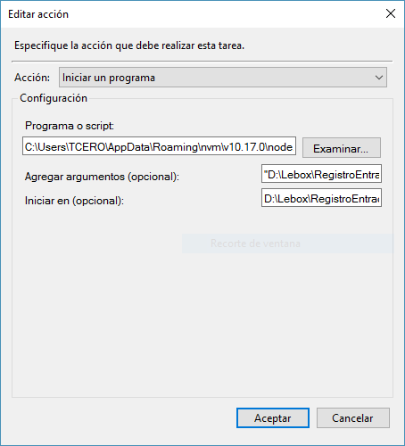

# Configurar

Instalar las librerías 
```js
npm install
```

Crear un archivo login.json con el siguiente contenido:

```js
{ "rut", "clave" }
```

Configurar el **Programador de tareas** con la siguiente acción:



dónde:
> Programa o script: *ruta de nodejs*.

> Agregar argumentos: *ruta de index.js*

> Iniciar en : *misma ruta anterior, sin comillas*

